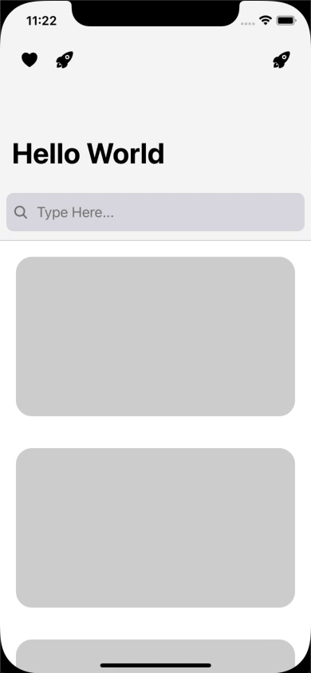

# React Native Scrollable Navigation Bar

| [Image Background Example](https://zobeirhamid.github.io/react-native-scrollable-navigation-bar/examples/image-background) | [Search Bar Example](https://zobeirhamid.github.io/react-native-scrollable-navigation-bar/examples/search-bar) |
| :------------------------------------------------------------------------------------------------------------------------: | :------------------------------------------------------------------------------------------------------------: |
|                                                                         |                                                                         |

## Getting Started

[Check out the docs](https://zobeirhamid.github.io/react-native-scrollable-navigation-bar)

## Features

- 60 FPS scroll animations
- Works on all Platforms
- Uses react-native Animated API, so no extra dependencies are needed
- Fully customizable

## Roadmap

- [ ] Custom RefreshControl Animation
- [ ] Supporting FlatList
- [ ] ScrollView Methods

## Bugs

- Web[iOS]: Bouncing won't scale up the HeaderBackground Component
- Web: Border flickering
